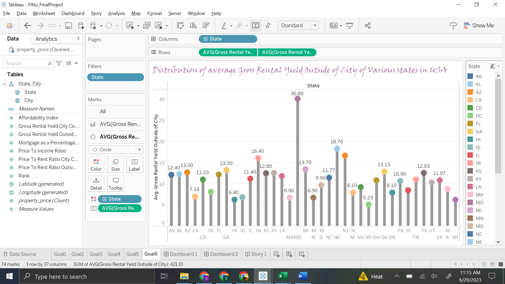

# Property Pricing Visualization

---

### Table of Contents
- [Introduction](#introduction)
- [Dataset](#dataset)
- [Data Cleaning](#data-cleaning)
- [Visualization Tools](#visualization-tools)
- [Project Goals](#project-goals)
- [Dashboards & Storyboards](#dashboards--storyboards)
- [Conclusion](#conclusion)
- [Technologies Used](#technologies-used)

---

### Introduction

The Property Pricing Visualization project provides insights into property pricing across various cities in the USA using charts and maps. The dataset includes:

* Price to Rent Ratio
* Gross Rental Yield
* Mortgage Value
* Affordability Index
* Price to Income Ratio

The project uses Excel and Tableau for visualization, creating dashboards and storyboards to effectively represent data insights.

**Domain**: Real Estate

---

### Dataset

- **Source:** [Kaggle - Property Prices in the United States](https://www.kaggle.com/datasets/themrityunjaypathak/property-prices-in-united-states)

  **Records**: 94

  **Columns**: 10

### Files in this repository:
- [`property.xlsx`](property.xlsx) – Original dataset downloaded from Kaggle  
- [`Cleaned_Property.xlsx`](Cleaned_Property.xlsx) – Dataset after cleaning and preprocessing  

---

### Data Cleaning

* Preprocessed a column by splitting it in Excel.
* Removed the original column after splitting to clean the dataset.

---

### Visualization Tools

* **Tableau**: Interactive charts, dashboards, and storyboards

* **Excel**: Charts and basic analysis

---

### Project Goals

* **Goal 1**: Distribution of Average Affordability Index by State

  Tool: Tableau (_Filled Map_)

  Insight: Maryland has the highest affordability index (12.8), Hawaii the lowest (1.30).

  Chart Placeholder: 

* **Goal 2**: Distribution of Mortgage across Top 10 Cities

  Tool: Tableau (_Line Chart_)

  Insight: Santa Barbara has the highest mortgage value (103.70), followed by Queens (91.30).

  Chart Placeholder: 

* **Goal 3**: Distribution of Price to Income Ratio across Top 10 Cities

  Tool: Tableau (_Bar Chart_)

  Insight: Santa Barbara has the highest ratio (13.30), followed by Brooklyn (11.20).

  Chart Placeholder: 

* **Goal 4**: Distribution of Gross Rental Yield (City Center) across Top 10 Cities

  Tool: Tableau (_Packed Bubble Chart_)

  Insight: Sarasota has the highest value (7.30), followed by Oakland (6.60).

  Chart Placeholder: 

* **Goal 5**: Distribution of Price to Rent Ratio (City Center) across Top 10 Cities

  Tool: Tableau (_Area Chart_)

  Insight: Queens has the highest value (35.50), followed by Sunnyvale (26.00).

  Chart Placeholder: 

* **Goal 6**: Distribution of Gross Rental Yield Outside of City by State

  Tool: Tableau (_Lollipop Chart_)

  Insight: Maryland has the highest value (30.80), New York the lowest (5.23).

  Chart Placeholder: 

* **Goal 7**: Distribution of Price to Rent Ratio Outside of City by State

  Tool: Excel (_Histogram_)

  Insight: New York has the highest value (19.35), Maryland the lowest (3.30).

  Chart Placeholder: 

---

### Dashboards & Storyboards

* **Dashboard 1**: Combines affordability and mortgage insights by state and city

  

* **Dashboard 2**: Combines rental yield and price-to-rent ratios for city center and outside city

  

* **Storyboard**: Presents a narrative connecting charts to provide insights for real estate investors

  
  
  
  
  
  
  
  

---

### Conclusion

* Santa Barbara has the highest mortgage and price-to-income ratio.

* Sarasota has the highest Gross Rental Yield (City Center).

* Queens has the highest Price to Rent Ratio (City Center).

* Maryland has the highest Affordability Index and Gross Rental Yield (Outside City).

* New York has the highest average Price to Rent Ratio (Outside City).

**Insight**: These visualizations provide valuable data-driven guidance for investors and individuals making real estate decisions.

---
  
  
